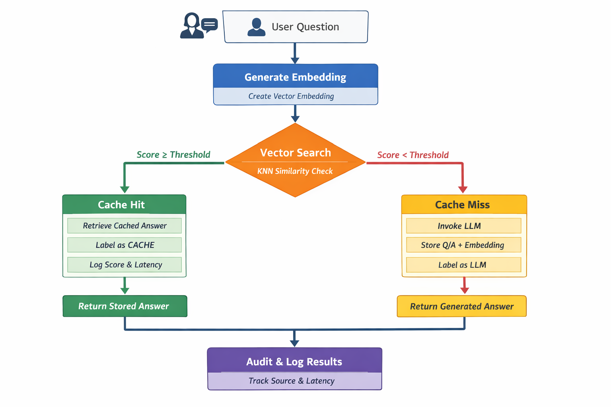

<body style="font-family:-apple-system,BlinkMacSystemFont,Segoe UI,Roboto,Helvetica,Arial,sans-serif;line-height:1.6;padding:20px;max-width:960px;margin:0 auto;color:#111;background:#fafafa;">

<h1 style="color:#2c3e50;">🧠 Agent Catalog</h1>

<strong>Agent Catalog</strong> is a production-grade AI retrieval system enforcing <strong>deterministic decision-making</strong> across <strong>Cache → Vector Search → LLM fallback</strong>.

It integrates <strong>Couchbase Vector Search</strong>, <strong>AWS Bedrock</strong>, and <strong>Streamlit</strong> to build explainable, auditable, and agent-ready AI pipelines.

<h2 style="color:#2c3e50;">✨ Key Features</h2>
<ul>
  <li>🔁 Deterministic routing: Cache → Vector → LLM</li>
  <li>🧠 Semantic reranking using LLMs (controlled & bounded)</li>
  <li>📊 Side-by-side scoring (Vector + Semantic)</li>
  <li>🧾 Full audit logging for observability</li>
  <li>🚦 Threshold-based LLM invocation</li>
  <li>🧩 Agent-ready architecture</li>
</ul>

<h2 style="color:#2c3e50;">🏗️ Architecture Overview</h2>
<pre style="background:#f6f8fa;padding:10px;border-radius:6px;overflow-x:auto;">
User Question
     |
     v
[ Cache Lookup ]
     |
     |-- HIT → Return Cached Answer
     |
     v
[ Vector Search (Couchbase FTS) ]
     |
     v
[ Semantic Reranker (LLM) ]
     |
     |-- Above Threshold → Return Vector Result
     |
     v
[ LLM Fallback ]
     |
     v
Store + Return Answer
</pre>

<h2 style="color:#2c3e50;">⚙️ Configuration</h2>
<ul>
  <li>Couchbase cluster & collections</li>
  <li>FTS vector index endpoint</li>
  <li>AWS Bedrock embedding + LLM models</li>
  <li>Score thresholds</li>
  <li>Retrieval depth (TOP_K)</li>
</ul>
<blockquote style="background:#fff3cd;padding:10px 15px;border-left:6px solid #ffeeba;border-radius:4px;margin:1em 0;">
⚠️ Security note: Secrets should be moved to environment variables in production.
</blockquote>

<h2 style="color:#2c3e50;">🚀 Running Locally</h2>
<pre style="background:#f6f8fa;padding:10px;border-radius:6px;overflow-x:auto;"><code>pip install -r requirements.txt
streamlit run hash_agentcatalog.py</code></pre>

<ul>
  <li>Top results table (Cache / Vector / LLM)</li>
  <li>Color-coded threshold violations</li>
  <li>Semantic score visualization</li>
  <li>Audit log explorer</li>
</ul>

<h2 style="color:#2c3e50;">📊 Scoring Model</h2>
<table style="border-collapse:collapse;width:100%;margin:1em 0;border:1px solid #ddd;">
  <caption style="font-weight:bold;margin-bottom:0.5em;">Score definitions</caption>
  <tr><th style="padding:10px;text-align:left;border:1px solid #ddd;">Score</th><th style="padding:10px;text-align:left;border:1px solid #ddd;">Description</th></tr>
  <tr><td style="padding:10px;border:1px solid #ddd;"><strong>Vector Score</strong></td><td style="padding:10px;border:1px solid #ddd;">Relative similarity from Couchbase FTS vector search</td></tr>
  <tr><td style="padding:10px;border:1px solid #ddd;"><strong>Semantic Score</strong></td><td style="padding:10px;border:1px solid #ddd;">LLM-based reranking relevance score</td></tr>
  <tr><td style="padding:10px;border:1px solid #ddd;"><strong>Threshold</strong></td><td style="padding:10px;border:1px solid #ddd;">Minimum score required to avoid LLM fallback</td></tr>
</table>

<h2 style="color:#2c3e50;">🧪 Why This Matters</h2>
<ul>
  <li>Prevent unnecessary LLM usage</li>
  <li>Eliminate hallucinated authority</li>
  <li>Combine probabilistic search with deterministic rules</li>
  <li>Enable agent toolchains safely</li>
  <li>Operate AI with <em>confidence</em>, not vibes</li>
</ul>

<h2 style="color:#2c3e50;">🧩 Agent-Ready Design</h2>

This system can be exposed as a <strong>tool</strong> to:

<ul>
  <li>LangChain agents</li>
  <li>Bedrock Agents</li>
  <li>Custom orchestration frameworks</li>
</ul>

Because results are scored, audited, and bounded, agents can:

<ul>
  <li>Trust responses</li>
  <li>Inspect provenance</li>
  <li>Decide whether escalation is required</li>
</ul>

<h2 style="color:#2c3e50;">📁 Project Structure</h2>
<pre style="background:#f6f8fa;padding:10px;border-radius:6px;overflow-x:auto;">
hash_agentcatalog.py    # End-to-end pipeline + UI
requirements.txt        # Python dependencies
README.html             # This document
pipeline-flow.png       # Image in same directory
</pre>

<h2 style="color:#2c3e50;">🔄 Decision Pipeline Flow</h2>

The diagram below illustrates request flow, with deterministic gates controlling when (and if) an LLM is invoked.

<strong>Key principle:</strong> LLMs are used <em>only</em> when cheaper, deterministic retrieval layers fail to meet confidence thresholds.

<h2 style="color:#2c3e50;">📜 License</h2>

MIT License — use freely, responsibly, and visibly.

<h2 style="color:#2c3e50;">🙌 Credits</h2>
<ul>
  <li>Couchbase Vector Search</li>
  <li>AWS Bedrock</li>
  <li>Streamlit</li>
  <li>Python</li>
</ul>

Designed for engineers who want <strong>control</strong>, not magic.

</body>
